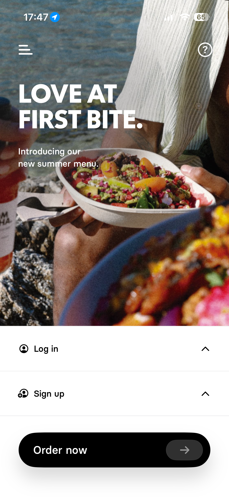
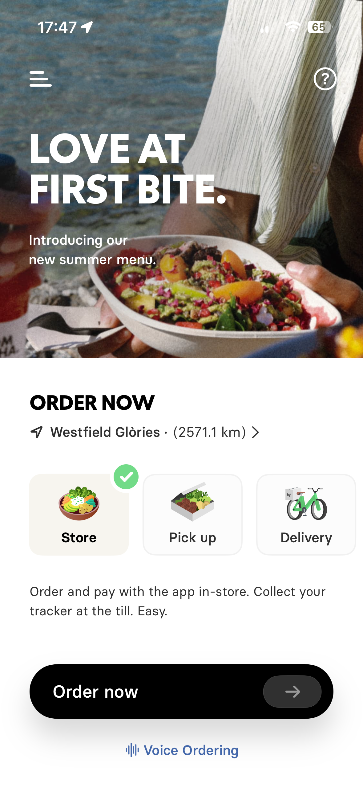
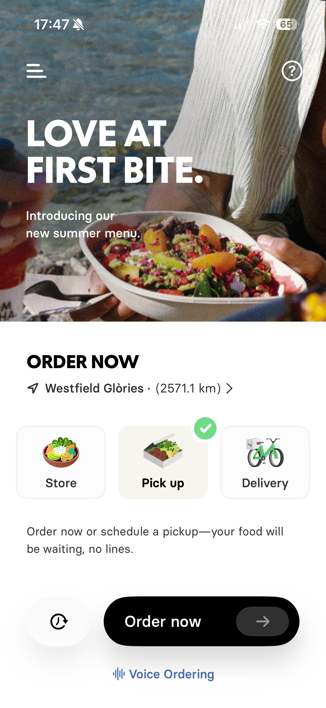
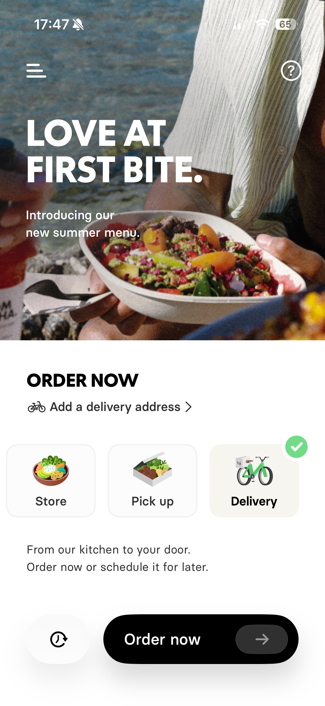
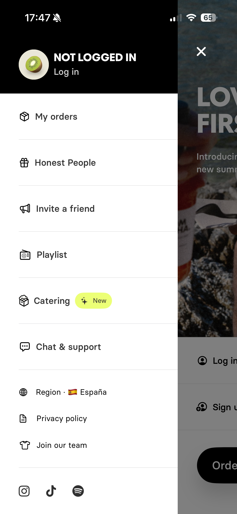
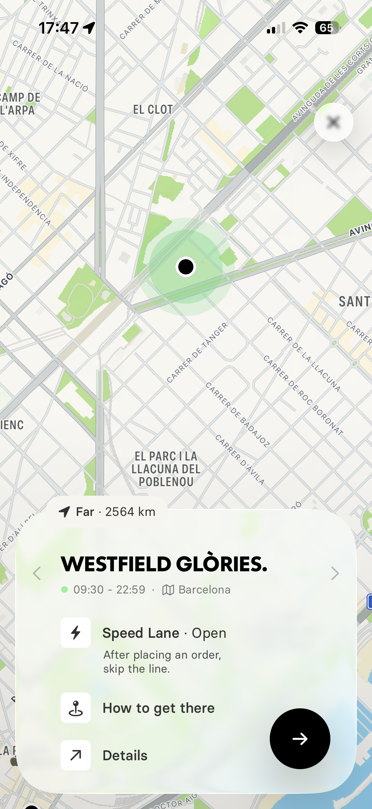
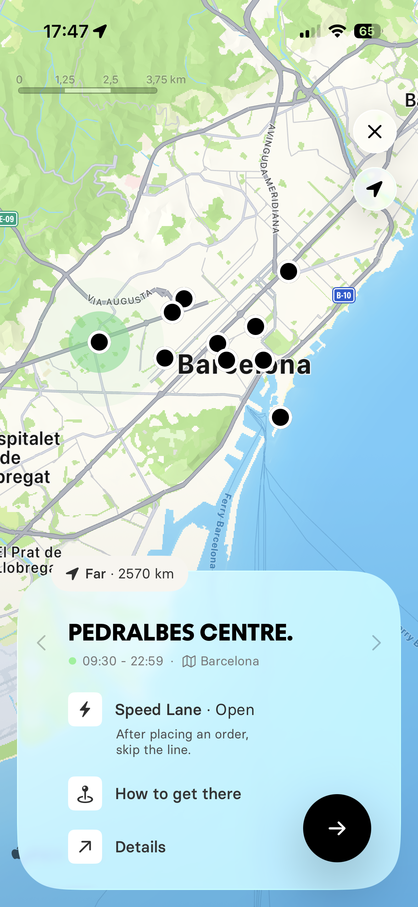
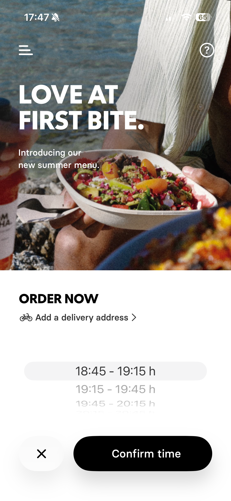
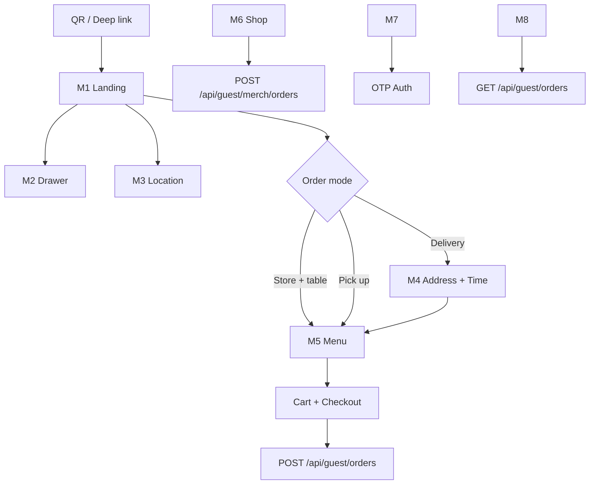

# Guest PWA — екрани, модулі, gap-аналіз

Референс-дизайн: скріни в `screens_for_pwa/` (auth1–auth8).  
Цільовий продукт: **Corgi Cafe Guest PWA** (`apps/guest`) + бекенд `apps/web` (`/api/guest/*`).

> Див. також: [GUEST_PWA.md](./GUEST_PWA.md) — API, бекенд, запуск dev.

---

## Зміст модулів

| Модуль | Скріни | Route (ціль) | Статус коду |
|--------|--------|--------------|-------------|
| M0 App Shell | — | `layout.tsx` | ⚠️ частково |
| M1 Landing / Order Hub | auth1, auth3–auth5 | `/` | ❌ redirect → `/menu` |
| M2 Side Drawer | auth2 | overlay | ❌ |
| M3 Location Picker | auth7, auth8 | `/locations` | ❌ |
| M4 Delivery Setup | auth5–auth6 | modal/sheet | ❌ |
| M5 Menu | — | `/menu` | ⚠️ wireframe |
| M6 Merch Shop | — | `/shop` | ⚠️ wireframe |
| M7 Loyalty & Auth | auth1–auth2 | `/loyalty` | ⚠️ wireframe |
| M8 Order History | auth2 | `/orders` | ⚠️ wireframe |
| M9 Bottom Nav | — | global | ✅ компонент |

---

## M0 — App Shell

**Файли:** `apps/guest/src/app/layout.tsx`, `lib/guest-context.tsx`, `components/BottomNav.tsx`

### Що має бути
- `GuestProvider` з URL params: `locationId`, `table` (QR зі столу)
- `getBootstrap()` при старті → locale, branding, features
- `BottomNav`: Menu · Shop · Loyalty · Orders (4 таби)
- PWA: `manifest.webmanifest`, `sw.js`, `beforeinstallprompt`
- Локалізація: `en | es | ca | uk` (`lib/i18n.ts`)

### Що зроблено
| Елемент | Статус |
|---------|--------|
| GuestProvider + searchParams | ✅ |
| BottomNav | ✅ (без дизайну) |
| SW register | ✅ |
| Welcome modal flag | ✅ в context, UI ❌ |
| Order mode (store/pickup/delivery) | ❌ |
| Side drawer | ❌ |
| Hero / landing замість redirect | ❌ |

### Gap
- `page.tsx` одразу редіректить на `/menu` — **немає landing hub з референсу**
- На референсі **немає bottom nav** на landing — nav з’являється після «Order now»
- Потрібен `orderMode` у context: `'store' | 'pickup' | 'delivery'`

---

## M1 — Landing / Order Hub

**Скріни:** `auth1.PNG`, `auth3.PNG`, `auth4.PNG`, `auth5.PNG`  
**Route (ціль):** `/` або `/home`

### auth1 — Welcome + Auth entry



| Зона | Опис |
|------|------|
| Hero | Full-bleed фото, заголовок **«LOVE AT FIRST BITE.»**, підзаголовок про summer menu |
| Top bar | Hamburger (ліворуч), Help `?` (праворуч), status bar iOS |
| Auth rows | **Log in** / **Sign up** — рядки з іконкою + chevron (accordion або перехід) |
| CTA | Чорна pill **«Order now»** + стрілка → |

**Поведінка:**
- Log in / Sign up → OTP flow (M7) або drawer (M2)
- Order now → M1 mode selection (auth3) або одразу menu якщо QR/table

### auth3 — Mode: Store (Dine-in / in-store)



| Зона | Опис |
|------|------|
| Hero | Той самий блок |
| ORDER NOW | Секція під hero |
| Location row | Pin + **«Westfield Glòries · (2571.1 km)»** + `>` → M3 |
| Mode cards | 3 картки: **Store** ✓ / Pick up / Delivery |
| Hint text | *«Order and pay with the app in-store. Collect your tracker at the till.»* |
| CTA | **Order now** → `/menu` (dine-in, table optional) |
| Extra | Voice Ordering (низ) — **v2, не в scope v1** |

### auth4 — Mode: Pick up



| Відмінність від auth3 |
|----------------------|
| **Pick up** обрано (зелена галочка) |
| Hint: *«Order now or schedule a pickup—your food will be waiting, no lines.»* |
| Зліва від CTA — **кнопка годинника** (schedule / order history) |
| Location row без зміни |

**Мапінг на Corgi:** Pick up → food order `source: takeaway` або окремий pickup flow

### auth5 — Mode: Delivery



| Відмінність |
|------------|
| **Delivery** обрано |
| Замість location row: **«Add a delivery address»** (велосипед + `>`) |
| Hint: *«From our kitchen to your door…»* |
| Кнопка schedule (годинник) + Order now |

**Мапінг:** Delivery — **немає в guest API v1** (тільки dine-in QR + takeaway logic частково)

### Статус реалізації M1

| Фіча | Бекенд | Фронт |
|------|--------|-------|
| Landing hero | — | ❌ |
| Order mode selector | частково (order `source`) | ❌ |
| Location row | ✅ bootstrap | ❌ UI |
| Delivery address | ❌ | ❌ |
| Schedule pickup time | ❌ | ❌ |
| Voice ordering | ❌ | ❌ |

---

## M2 — Side Drawer (Hamburger Menu)

**Скрін:** `auth2.PNG`  
**Тип:** overlay drawer зліва (~85% ширини)



### Header (чорний)
| Елемент | Опис |
|---------|------|
| Avatar | Кругле фото (kiwi) |
| Статус | **NOT LOGGED IN** або ім’я після логіну |
| Link | **Log in** (underline) |

### Primary nav
| Item | Іконка | Corgi v1 |
|------|--------|----------|
| My orders | box | ✅ → `/orders` |
| Honest People | gift | ✅ → `/loyalty` (перейменувати) |
| Invite a friend | megaphone | ❌ referral v2 |
| Playlist | radio | ❌ |
| Catering | box + **New** badge | ❌ |
| Chat & support | chat | ❌ |

### Secondary
| Item | Corgi v1 |
|------|----------|
| Region · 🇪🇸 España | ⚠️ locale picker (`setLocale`) |
| Privacy policy | ❌ static page |
| Join our team | ❌ careers link |

### Footer
Instagram · TikTok · Spotify — ❌ v2

### Статус
**Повністю відсутній** — потрібен `components/SideDrawer.tsx` + стан у context або URL `?drawer=1`

---

## M3 — Location Picker (Map + Store Card)

**Скріни:** `auth7.PNG`, `auth8.PNG`  
**Route (ціль):** `/locations` або modal з landing

  


### Map layer
- Full-screen map (Mapbox — токен уже є в staff `.env`)
- Pins: чорні крапки по локаціях
- Active pin: зелений pulse halo
- Top-right: **X** close, **my location** arrow
- Scale bar, distance badge: «Far · 2564 km»

### Bottom card (swipe між локаціями `<` `>`)
| Поле | Приклад |
|------|---------|
| Назва | WESTFIELD GLÒRIES / PEDRALBES CENTRE |
| Status | 🟢 Open · 09:30 – 22:59 |
| Місто | Barcelona |
| Speed Lane | ⚡ Open — skip the line (**auth8**) |
| How to get there | deep link Maps |
| Details | store info page |
| CTA | Чорне коло **→** — підтвердити `locationId` |

### API / дані
| Потрібно | Є зараз |
|----------|---------|
| Список локацій | ✅ `GET /api/locations` (staff) — **немає guest-public list** |
| Координати, hours | ⚠️ частково в Prisma Location |
| Speed lane flag | ❌ |
| Відстань GPS | ❌ (клієнт) |

### Gap
- Guest bootstrap приймає один `locationId` з URL — **немає UI вибору**
- Потрібен або `GET /api/guest/locations` або reuse staff `/api/locations` без auth
- QR flow: table → `bootstrap` вже знає location — map **опційний**

---

## M4 — Delivery Address & Time Slot

**Скріни:** `auth5.PNG`, `auth6.PNG`



### Address (auth5)
- Row «Add a delivery address» → форма / autocomplete

### Time picker (auth6)
- Bottom sheet, scroll slots: `18:45 – 19:15 h`, …
- **Confirm time** (black pill) + **X** cancel

### Статус
| Фіча | Бекенд | Фронт |
|------|--------|-------|
| Delivery zones | ❌ | ❌ |
| Address geocoding | ❌ | ❌ |
| Scheduled slots | ❌ | ❌ |

**v1 Corgi:** фокус на **QR dine-in** + **pickup merch** — delivery можна відкласти.

---

## M5 — Menu (страхи / каталог)

**Route:** `/menu`  
**Скрінів у папці немає** — орієнтир: стандартний food app після «Order now».

### Цільовий UX (після референсу)
- Sticky categories (horizontal chips)
- Картки страв: фото, назва, ціна, алергени
- Tap → **Item sheet**: modifiers, comments, Add to cart
- Floating **cart bar** → checkout sheet
- Checkout: tip, loyalty points, confirm → `POST /api/guest/orders`

### Що зроблено (wireframe, без дизайну)

`apps/guest/src/app/menu/page.tsx`:

| Фіча | Статус |
|------|--------|
| Завантаження menu API | ⚠️ баг: `bootstrap.location.id` (має бути `locationId`) |
| Категорії + список | ✅ plain HTML |
| Modal customize + comments | ✅ базово |
| Modifiers UI | ❌ (state є, UI ні) |
| Cart + qty | ✅ |
| Checkout dine-in | ✅ `createOrder` |
| `tableId` з bootstrap | ⚠️ перевірити поле `table` vs `tableId` |
| `basePrice` vs `price` | ⚠️ баг у типах |

### Gap vs дизайн
- Hero / branding відсутні
- Немає cart sheet, images, i18n labels
- Немає loyalty points на checkout
- Немає order tracker після submit

---

## M6 — Merch Shop

**Route:** `/shop`

### Цільовий UX
- Grid товарів (фото, ціна, stock badge)
- Окремий merch cart
- Checkout → pickup at counter

### Що зроблено

`apps/guest/src/app/shop/page.tsx`:

| Фіча | Статус |
|------|--------|
| Catalog API | ✅ |
| Add to cart | ✅ |
| Merch order | ✅ `createMerchOrder` |
| Stock limit UI | ❌ |
| Images | ❌ |
| Confirm pickup | на `/orders` |

---

## M7 — Loyalty & Authentication

**Скріни:** auth1 (login rows), auth2 (drawer header)  
**Route:** `/loyalty`

### Цільовий UX
- Phone OTP → verify → session cookie
- New user → register (name, email, allergies)
- Logged in: tier, points, QR card, progress to next tier
- Drawer показує ім’я замість NOT LOGGED IN

### Що зроблено

`apps/guest/src/app/loyalty/page.tsx`:

| Фіча | Статус |
|------|--------|
| OTP request + devCode | ✅ |
| OTP verify | ✅ |
| Register form | ✅ |
| Loyalty profile | ⚠️ баг: `loyalty.tier` vs `loyalty.customer.tier` |
| QR display | ⚠️ текст замість QR image |
| Logout | ✅ |
| Allergy update | ✅ |
| Transactions history | ❌ API є, UI ні |

### API
- `POST /api/guest/auth/otp/request|verify`
- `POST /api/guest/auth/register`
- `GET /api/guest/me/loyalty`
- `GET /api/guest/me/loyalty/transactions`

---

## M8 — Order History

**Скрін:** auth2 → «My orders»  
**Route:** `/orders`

### Цільовий UX
- Список карток: номер, статус, сума, час
- Tap → detail sheet
- Merch `ready` → **Confirm Pickup**
- Food orders: статус preparing / ready / served

### Що зроблено

`apps/guest/src/app/orders/page.tsx`:

| Фіча | Статус |
|------|--------|
| List orders (auth required) | ✅ |
| Detail modal | ✅ plain |
| Confirm merch pickup | ✅ |
| Login gate message | ✅ |
| Status badges / timeline | ❌ |
| Real-time updates (WS) | ❌ |

---

## M9 — Bottom Navigation

**Файл:** `components/BottomNav.tsx`

| Tab | Route | Icon |
|-----|-------|------|
| Menu | `/menu` | Coffee |
| Shop | `/shop` | ShoppingBag |
| Loyalty | `/loyalty` | Gift |
| Orders | `/orders` | ClipboardList |

- Badge count на food/merch cart ✅
- i18n labels ✅
- **На landing (M1) bottom nav має ховатись** — ❌ зараз завжди видимий

---

## User Flow (цільовий)



### QR зі столу (пріоритет v1)
```
?locationId=default&table=T-12
  → bootstrap (table resolved)
  → skip map якщо table відомий
  → Store mode auto-selected
  → /menu
```

---

## Gap Summary — що доробити

### P0 (блокери функціоналу)
1. **Виправити bootstrap fields** — `locationId`, `tableId` (не `bootstrap.location.id`)
2. **Виправити menu item price** — `basePrice` з contracts
3. **Виправити loyalty response mapping** — `customer`, `qrCode`
4. **Landing M1** замість blind redirect `/` → `/menu`
5. **`orderMode` в GuestContext**

### P1 (референс UX core)
6. **M2 Side drawer** (orders, loyalty, locale, login)
7. **M3 Location picker** (якщо без QR table)
8. **M5 Menu UI** — categories, images, modifier sheet, cart bar
9. **Приховати BottomNav** на landing / auth sheets
10. **Welcome / install PWA modal** (context готовий)

### P2 (розширення)
11. M4 Delivery + scheduling
12. Loyalty transactions list
13. QR code render (canvas)
14. `pointsToSpend` на checkout
15. Referral, catering, support, social links
16. Voice ordering

### Бекенд gaps для дизайну
| Фіча | Потрібен API |
|------|----------------|
| Guest locations list + coords | `GET /api/guest/locations` |
| Store hours / open now | розширити Location model |
| Speed lane | location feature flags |
| Delivery | addresses, zones, slots |
| Order scheduling | `scheduledAt` на Order |

---

## Поточна структура `apps/guest` — оцінка

```
apps/guest/src/
├── app/
│   ├── layout.tsx          ✅ shell (потрібен hide nav на /)
│   ├── page.tsx            ⚠️ тільки redirect — замінити на M1
│   ├── menu/page.tsx       ⚠️ wireframe + баги API fields
│   ├── shop/page.tsx       ⚠️ wireframe
│   ├── loyalty/page.tsx    ⚠️ wireframe + баги loyalty shape
│   └── orders/page.tsx     ⚠️ wireframe
├── components/
│   └── BottomNav.tsx       ✅
└── lib/
    ├── api-client.ts       ✅ повний клієнт
    ├── guest-context.tsx   ✅ (+ потрібен orderMode)
    └── i18n.ts             ✅
```

### Відсутні файли / папки
```
components/
  SideDrawer.tsx
  HeroHeader.tsx
  OrderModeCards.tsx
  LocationMapSheet.tsx
  TimeSlotSheet.tsx
  MenuCard.tsx
  ItemCustomizeSheet.tsx
  CartBar.tsx
  OtpSheet.tsx
  LoyaltyCard.tsx
  OrderCard.tsx
app/
  home/page.tsx          # або переписати page.tsx
  locations/page.tsx
```

---

## Рекомендований порядок імплементації UI

1. Fix API field bugs (P0) — menu/shop/loyalty працюють з бекендом
2. `home/page.tsx` — M1 landing (static hero + mode cards)
3. `SideDrawer` + hamburger у hero
4. Menu redesign (M5) — найбільший ROI для QR flow
5. Loyalty card + real QR (M7)
6. Location map (M3) — якщо потрібен без-QR сценарій
7. Polish: shop, orders, PWA install banner

---

## Assets

| Файл | Модуль | Опис |
|------|--------|------|
| `screens_for_pwa/auth1.PNG` | M1 | Welcome + login/signup + Order now |
| `screens_for_pwa/auth2.PNG` | M2 | Side drawer (logged out) |
| `screens_for_pwa/auth3.PNG` | M1 | Store / dine-in mode |
| `screens_for_pwa/auth4.PNG` | M1 | Pick up mode + schedule btn |
| `screens_for_pwa/auth5.PNG` | M1, M4 | Delivery + add address |
| `screens_for_pwa/auth6.PNG` | M4 | Time slot bottom sheet |
| `screens_for_pwa/auth7.PNG` | M3 | Map — Westfield Glòries card |
| `screens_for_pwa/auth8.PNG` | M3 | Map — Pedralbes + Speed Lane |
