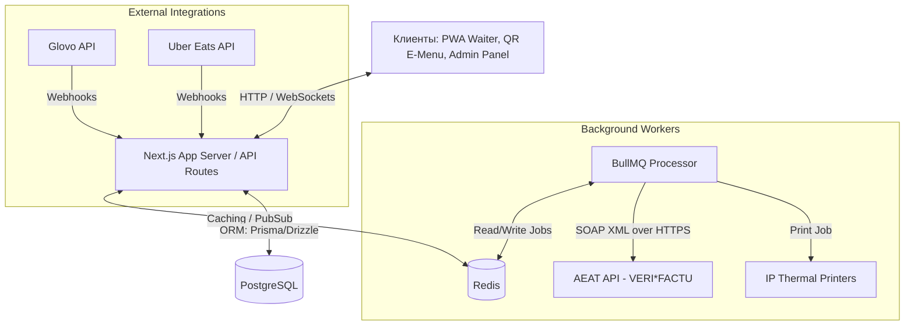
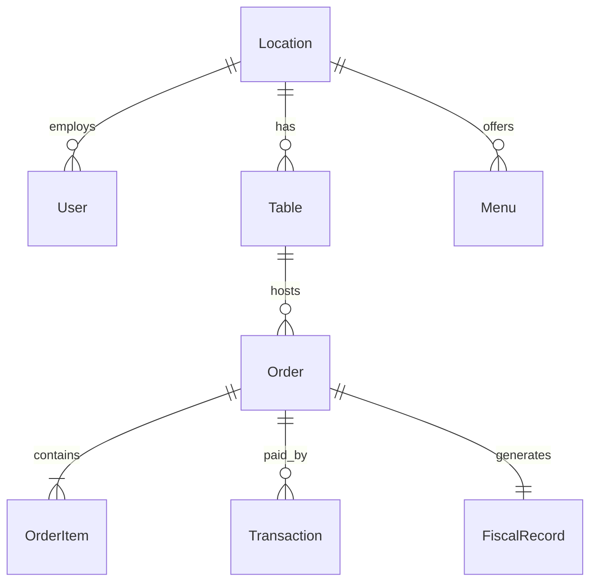
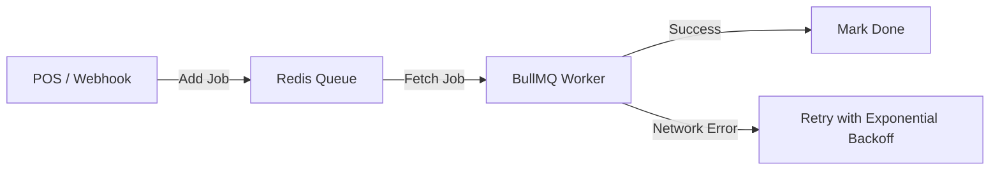

# Архитектура бэкенда: Corgi Cafe POS

Этот документ описывает целевую бэкенд-архитектуру для проекта Corgi POS, обеспечивающую масштабируемость, отказоустойчивость, работу в реальном времени и полное соответствие испанскому налоговому законодательству (VERI*FACTU).

---

## 1. Общая топология системы

Проект разрабатывается как монорепозиторий (Monorepo), управляемый с помощью **Turborepo**.



### Выбор серверной технологии
1. **Next.js API Routes (Node.js)**: Поскольку проект уже построен на Next.js App Router, для ускорения разработки и минимизации накладных расходов бэкенд-эндпоинты и вебхуки реализуются в рамках API Routes (`src/app/api`).
2. **Отдельный Node.js Worker**: Для фоновой обработки очередей (BullMQ) запускается легковесный параллельный Node.js процесс. Это позволяет не блокировать основной поток обработки HTTP-запросов и избегать таймаутов на Serverless/Edge-платформах.

---

## 2. База данных и неизменяемый фискальный реестр (VERI*FACTU)

### СУБД: PostgreSQL
Выбирается **PostgreSQL** благодаря поддержке сложных транзакций, оконных функций для аналитики и возможности создания триггеров для обеспечения неизменяемости (immutability).

### Схема данных (Основные сущности)


1. **`locations`**: Филиалы ресторана.
2. **`users` & `roles`**: Пользователи, доступы (Permissions Matrix).
3. **`tables`**: Столы (ID, координаты SVG, статус).
4. **`orders`**: Заказы (Dine-in, Takeaway, Delivery).
5. **`fiscal_records`**: Фискальный реестр (Simplificada / Completa).

### Реализация неизменяемого реестра (Append-Only Ledger)
Испанский регламент VERI*FACTU строго запрещает модификацию и удаление фискальных записей.

#### Шаг A: Защита на уровне БД (Триггеры)
Создается триггерная функция в PostgreSQL, которая предотвращает операции `UPDATE` и `DELETE` для таблицы `fiscal_records`:
```sql
CREATE OR REPLACE FUNCTION prevent_fiscal_modification()
RETURNS TRIGGER AS $$
BEGIN
    RAISE EXCEPTION 'Fiscal records are immutable. Modification and deletion are strictly prohibited by VERI*FACTU regulations.';
END;
$$ LANGUAGE plpgsql;

CREATE TRIGGER check_fiscal_immutability
BEFORE UPDATE OR DELETE ON fiscal_records
FOR EACH ROW EXECUTE FUNCTION prevent_fiscal_modification();
```

#### Шаг B: Корректирующие чеки (Facturas Rectificativas)
Любая отмена или возврат происходит через создание новой фискальной записи с противоположным знаком (кредит-нота), которая содержит ссылку на `original_fiscal_record_id`.

#### Шаг C: Криптографическое связывание (Chaining / Huella Hash)
Каждая запись в `fiscal_records` должна ссылаться на предыдущую. Хеш генерируется с помощью SHA-256 на сервере перед записью в БД.

Строка для хеширования формируется строго по регламенту AEAT:
$$\text{Payload} = \text{NIF\_Emisor} + \text{Num\_Factura} + \text{Fecha\_Expedicion} + \text{Tipo\_Factura} + \text{Cuota\_IVA} + \text{Importe\_Total} + \text{Hash\_Previo}$$

```typescript
import { createHash } from 'crypto';

export function calculateHuellaHash(data: {
  nifEmisor: string;
  numFactura: string;
  fechaExpedicion: string;
  tipoFactura: string;
  cuotaTotal: number;
  importeTotal: number;
  prevHash: string;
}): string {
  // Форматирование по стандарту AEAT
  const rawString = `IDEmisorFactura=${data.nifEmisor}&NumSerieFactura=${data.numFactura}&FechaExpedicionFactura=${data.fechaExpedicion}&TipoFactura=${data.tipoFactura}&CuotaTotal=${data.cuotaTotal.toFixed(2)}&ImporteTotal=${data.importeTotal.toFixed(2)}&Huella=${data.prevHash}`;
  
  return createHash('sha256')
    .update(rawString, 'utf8')
    .digest('hex')
    .toUpperCase();
}
```

---

## 3. Кэширование и Реальное время (Caching & WebSockets)

### Кэш на базе Redis
Redis используется для трех основных целей:

1. **Кэширование меню и настроек**: Меню заведения кэшируется с долгим TTL и инвалидируется только при редактировании блюда или категории в `/menu`.
2. **Сессии пользователей**: Хранение токенов авторизации персонала.
3. **Быстрое состояние столов**: Поскольку статус стола (`available`, `occupied`, `billed`, `dirty`) меняется часто, текущая карта зала хранится в Redis (хэш-сеты), периодически синхронизируясь с основной БД.

### Синхронизация в реальном времени (WebSockets)
Для мгновенного обновления терминалов официантов, KDS-экранов и панели администрирования:

* **Технология**: **Socket.io** (или легковесный `ws` сервер), развернутый рядом с Next.js или на отдельном Node.js инстансе.
* **Событийная модель**:
  * `order:new` -> отправка тикета на KDS.
  * `table:status_change` -> обновление цвета стола на SVG-карте зала у всех официантов.
  * `waiter:call` -> вызов официанта к столу (с QR-меню).
* **Горизонтальное масштабирование**: Если серверов несколько, используется **Redis Pub/Sub adapter** для Socket.io, чтобы синхронизировать WebSocket-события между инстансами.

---

## 4. Очереди задач и Фоновые процессы (BullMQ)

Для надежной обработки асинхронных операций используется **BullMQ** (очереди поверх Redis).



### Основные очереди:

1. **`verifactu-sync` (Фискальная синхронизация)**:
   * **Логика**: При переходе заказа в статус `completed`, данные преобразуются в XML (согласно схеме `SuministroLR.xsd`), подписываются приватным ключом (цифровым сертификатом) и отправляются по SOAP HTTPS на сервер AEAT.
   * **Отказоустойчивость**: В случае недоступности серверов налоговой (ошибка сети), BullMQ автоматически повторяет попытку с экспоненциальной задержкой (Exponential Backoff). Заказ при этом не блокируется, кассир продолжает работу.
2. **`webhook-processing` (Обработка интеграций)**:
   * **Логика**: При приеме вебхуков от Uber Eats или Glovo, сервер мгновенно возвращает `200 OK` отправителю, а тело запроса уходит в очередь. Воркер валидирует подпись, вытягивает детали заказа через партнерские API и обновляет систему.
3. **`kitchen-printing` (Печать чеков)**:
   * **Логика**: Отправка заданий на печать на локальные IP-принтеры чеков (ESC/POS протокол) через сетевой сокет.

---

## 5. Offline-First & Гибридное приложение (Capacitor)

Для терминалов официантов (мобильные планшеты) критически важно иметь стабильную офлайн-работу и возможность прямого сопряжения с торговым оборудованием (принтеры, терминалы). Вместо чистого браузерного PWA интерфейс POS-терминала упаковывается в гибридное мобильное приложение с помощью **Capacitor.js**.

### Архитектура мобильного клиента
* **Базовая кодовая база**: Единный Next.js проект. Роут `/pos` экспортируется статически (`output: export` или рендерится как SPA-клиент) и собирается в нативный контейнер Capacitor.
* **Доступ к оборудованию**: Использование плагинов Capacitor для прямой работы с Bluetooth LE (BLE), USB и локальными сетями для отправки команд печати ESC/POS и связи с платежными терминалами.
* **Клиентская база данных**:
  * **IndexedDB (библиотека Dexie.js)**: Локальная база данных в памяти приложения.
  * База имеет гарантированную квоту хранения и защиту от случайного удаления операционной системой (в отличие от стандартного Safari/Chrome PWA).

### Репликация данных при сбоях связи
1. **При старте смены**: В IndexedDB скачивается весь справочник меню, аллергенов и актуальная карта столов.
2. **Создание заказа оффлайн**:
   * Заказ записывается локально в IndexedDB со статусом `sync_pending: true`.
   * Принтер на кухне печатает бегунок (отправка RAW-команд по Bluetooth/LAN напрямую с планшета через плагины Capacitor).
3. **Восстановление сети**:
   * Встроенный сетевой слушатель (Network Listener) обнаруживает соединение.
   * Отправляет пакет неотправленных заказов на бэкенд `/api/orders/sync`.
   * Сервер сохраняет их в PostgreSQL, формирует фискальные записи и возвращает подтверждения.

---

## 6. Безопасность и Валидация

1. **Аутентификация персонала**: JWT-токены с коротким временем жизни (хранятся в защищенных `HttpOnly` куках). Авторизация на кассе по быстрому PIN-коду сотрудника (с хэшированием PIN на сервере).
2. **Контроль доступа (RBAC)**: Middleware на бэкенде сверяет права пользователя перед выполнением чувствительных действий (например, удаление блюда из чека требует роли `manager` или `admin`).
3. **Валидация вебхуков**: Проверка HMAC-подписей для входящих запросов от Uber Eats (`X-Uber-Signature`) и Glovo для предотвращения подделки заказов.

---

## Вопросы для обсуждения

> [!IMPORTANT]
> Для финализации архитектуры нам необходимо обсудить несколько ключевых моментов:
>
> 1. **Развертывание (Deployment)**: Планируется ли использование Docker-контейнеров (например, Node.js + PostgreSQL + Redis в docker-compose) для локального запуска и продакшена?
> 2. **Цифровой сертификат (VERI\*FACTU)**: Будет ли использоваться официальный тестовый сертификат AEAT на этапе разработки для отладки SOAP-запросов?
> 3. **Интеграция с принтерами**: Как физически планируется связывать планшеты официантов с термопринтерами? Напрямую из браузера по протоколу TCP/IP (требует доступности принтера в локальной сети) или через локальный сервер-посредник (например, принтер-сервер на Raspberry Pi)?
