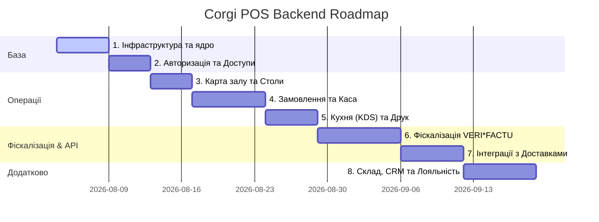

# План розробки бекенду Corgi POS по модулях

Цей документ визначає послідовний графік та технічний зміст розробки бекенд-інфраструктури для проекту Corgi POS. Кожен етап будується на базі попереднього, що забезпечує стабільність та простоту інтеграційного тестування.

---

## 📅 Послідовність етапів розробки

---

## 🛠️ Детальний опис модулів

### 1. Інфраструктура та спільне ядро (Foundation Layer)
* **Мета**: Перехід від браузерного `localStorage` до повноцінного збереження даних у реляційній базі даних.
* **База даних**:
  * Створення Docker-оточення для PostgreSQL та Redis (`docker-compose.yml`).
  * Налаштування ORM (Prisma/Drizzle) та генерація клієнта БД.
  * Визначення TypeScript інтерфейсів у [lib/types](file:///Users/vytvytskyi/corgi_cafe/apps/web/src/lib/types).
* **Компоненти бэкенду**:
  * Реалізація [base.repository.ts](file:///Users/vytvytskyi/corgi_cafe/apps/web/src/repositories/base.repository.ts) для запитів до PostgreSQL.
  * Налаштування підключення до Redis для кэшування.

---

### 2. Авторизація та права доступу (Auth & Roles Module)
* **Мета**: Контроль безпеки дій персоналу та розмежування прав доступу на POS-терміналі.
* **База даних**:
  * Таблиці: `users`, `roles`, `permissions`, `user_roles`.
* **API & Сервіси**:
  * `POST /api/auth/login-pin` — авторизація співробітника за PIN-кодом, генерація JWT.
  * `POST /api/auth/logout` — інвалідація сесії в Redis.
  * Глобальний Middleware для перевірки прав доступу (Permissions Matrix) перед виконанням чутливих операцій.

---

### 3. Карта залу та столи (Locations & Tables Module)
* **Мета**: Збереження структури закладу та забезпечення реального часу (real-time) для статусу столів.
* **База даних**:
  * Таблиці: `locations`, `tables`, `zones`. Збереження SVG-координат столів та стін.
* **API & Real-time**:
  * `GET /api/locations` — список локацій та їх залів.
  * `POST /api/tables/layout` — збереження нової SVG-карти залу з редактора.
  * WebSocket-подія `table:status_change` — розсилка нового статусу столу всім підключеним пристроям при посадці гостей або оплаті рахунку.

---

### 4. Замовлення та касові зміни (POS & Order Lifecycle Module)
* **Мета**: Управління життєвим циклом замовлень та грошовою дисципліною в касі.
* **База даних**:
  * Таблиці: `orders`, `order_items`, `transactions`, `cash_shifts` (касові зміни).
* **API & Сервіси**:
  * `POST /api/shifts/open` / `close` — відкриття/закриття зміни з перевіркою залишку каси (Blind Close).
  * `POST /api/orders` — створення замовлення.
  * `POST /api/orders/:id/split` — логіка розділення рахунку (на рівні транзакцій у БД).
  * `POST /api/orders/:id/pay` — реєстрація транзакції (налічка, картка, бонуси).
  * Інтеграція [OrderService](file:///Users/vytvytskyi/corgi_cafe/apps/web/src/services/order.service.ts) з реальною БД.

---

### 5. Кухня (KDS) та друк зустрічок (Kitchen & Printers Module)
* **Мета**: Миттєва передача замовлень на кухню та бар для початку готування.
* **Компоненти**:
  * WebSocket-канал для KDS: подія `order:preparing` оновлює Kanban-дошку кухарів.
  * Налаштування **BullMQ** черги `kitchen-printing` для фонової обробки завдань друку з хмари (для фіскальних рахунків).
  * **Інтеграція з Capacitor**: На мобільному планшеті реалізується пряме надсилання RAW-команд друку ESC/POS на локальний IP/Bluetooth принтер через нативні плагіни Capacitor (це забезпечує друк оффлайн-чеків без інтернету).

---

### 6. Фіскалізація та VERI*FACTU (Spanish Tax Compliance)
* **Мета**: Повний захист від маніпуляцій з чеками та автоматична звітність перед Agencia Tributaria (AEAT).
* **База даних**:
  * Таблиця `fiscal_records` з PostgreSQL-триггером заборони оновлення та видалення (`BEFORE UPDATE OR DELETE ON fiscal_records -> RAISE EXCEPTION`).
* **Логіка VERI\*FACTU**:
  * Генерація криптографічного ланцюжка SHA-256 (Huella Hash) на основі поточного та попереднього чека у [audit.ts](file:///Users/vytvytskyi/corgi_cafe/apps/web/src/lib/audit.ts).
  * Фоновий BullMQ воркер `verifactu-sync`:
    * Створення XML-запиту SOAP відповідно до схеми `SuministroLR.xsd`.
    * Подпис XML цифровим сертифікатом.
    * Передача на шлюз AEAT з автоматичним ретраєм (exponential backoff) у разі помилки зв'язку.
  * Генерація URL для фіскальних QR-кодів на чеках.

---

### 7. Інтеграція з агрегаторами доставки (Delivery Webhooks)
* **Мета**: Синхронізація замовлень із зовнішніх сервісів Glovo та Uber Eats без ручного введення.
* **API & Сервіси**:
  * Обробники вебхуків у [ubereats/route.ts](file:///Users/vytvytskyi/corgi_cafe/apps/web/src/app/api/webhooks/ubereats/route.ts) та директорії [glovo](file:///Users/vytvytskyi/corgi_cafe/apps/web/src/app/api/webhooks/glovo).
  * Валідація сигнатур вхідних POST-запитів (`HMAC SHA256`).
  * BullMQ воркер `delivery-ingest` для фонового отримання складу замовлення від API агрегатора та пушу в систему POS.

---

### 8. Склад мерчу, CRM та програма лояльності (Marketing & Inventory)
* **Мета**: Облік нехарчових товарів (сувеніри, одяг) та утримання постійних гостей.
* **База даних**:
  * Таблиці: `merch_inventory`, `inventory_transfers`, `customers`, `loyalty_transactions`.
* **API & Сервіси**:
  * Автоматичне списання залишків мерчу з таблиці `merch_inventory` після проведення чеку через касу.
  * Розрахунок кэшбеку клієнта (Loyalty Tiers: Silver, Gold, VIP) на основі накопиченого LTV.
  * Календар акцій "Happy Hours" для автоматичної переоцінки страв.
