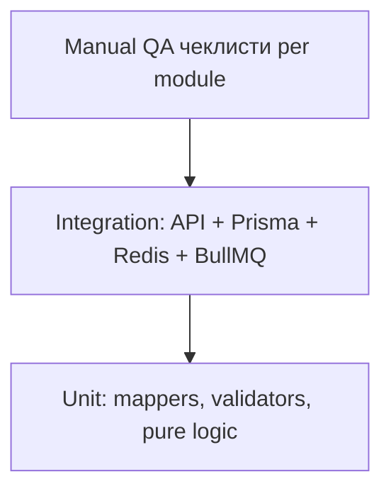
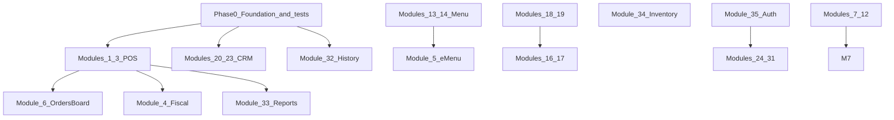

# Оновлений план FE-BE: модулі 1–35 (повна версія)

> Master-plan інтеграції фронтенду з PostgreSQL через Next.js API.  
> Замінює/доповнює [`fe-be.md`](fe-be.md) з виправленими статусами, детальними кроками та **повною стратегією тестування**.

---

## Зміст

1. [Діагноз](#діагноз)
2. [Глобальна матриця статусів](#глобальна-матриця-статусів)
3. [Стратегія тестування](#стратегія-тестування)
4. [Фаза 0 — Спільний фундамент](#фаза-0--спільний-фундамент)
5. [Модулі 1–5: POS та eMenu](#модулі-15-pos-та-emenu)
6. [Модулі 6–12: Операції](#модулі-612-операції)
7. [Модулі 13–15: Меню](#модулі-1315-меню)
8. [Модулі 16–19: Персонал](#модулі-1619-персонал)
9. [Модулі 20–23: CRM](#модулі-2023-crm)
10. [Модулі 24–31: Settings](#модулі-2431-settings)
11. [Модулі 32–35: History, Reports, Inventory, Auth](#модулі-3235-history-reports-inventory-auth)
12. [API Catalog](#api-catalog)
13. [Хвилі виконання](#хвилі-виконання)
14. [Master TODO](#master-todo)

---

## Діагноз

Поточний [`fe-be.md`](fe-be.md) часто позначає модулі 🟢 при **partial/mock** інтеграції. Корінь проблем:

| Проблема | Наслідок |
|----------|----------|
| 3 паралельні моделі `Order` (Prisma / domain.ts / lib/orders.ts) | Замовлення зникають після refresh, `paid` завжди false |
| `*Async()` helpers написані, UI викликає `getX()` localStorage | API існує, дані не доходять до екрану |
| Plan API paths ≠ code paths (`/api/crm` vs `/api/crm/customers`) | Плутанина при wiring |
| Prisma models відсутні для Task, TimeCard, ShiftSchedule, Modifiers… | Ці модулі неможливо підключити без schema sprint |
| Тести існують, але не покривають mapper layer і FE wiring | Regression при кожному новому модулю |

**Критичні баги (виправити в Phase 0):**
- [`order.repository.ts`](../apps/web/src/repositories/order.repository.ts) `findActiveOrders`: `['draft','pending','cooking','ready']` vs UI `'preparing'`
- [`lib/orders.ts`](../apps/web/src/lib/orders.ts) `getOrdersAsync`: мапить `o.time`, API повертає `createdAt`
- `locationId`: UI `'default'` vs repository fallback `'default-location'`

---

## Глобальна матриця статусів

| # | Модуль | Plan | BE | FE | Schema | Пріор. |
|---|--------|------|----|----|--------|--------|
| 1 | TablesView | 🟢 | ready | wired | ready | P0 |
| 2 | POS Terminal | 🟢 | ready | wired | ready | P0 |
| 3 | Payment | 🟢 | ready | wired | ready | P0 |
| 4 | Refunds/Fiscal | 🟢 | ready | wired | ready | P1 |
| 5 | eMenu | 🟢 | ready | wired | ready | P2 |
| 6 | OrdersBoard | 🟢 | ready | wired | ready | P0 |
| 7 | TaskManager | 🟢 | ready | wired | ready | P4 |
| 8 | NewTaskModal | 🟢 | ready | wired | ready | P4 |
| 9 | BoardSettings | 🟢 | ready | wired | ready | P4 |
| 10 | DailyChecklists | 🟢 | ready | wired | ready | P4 |
| 11 | PhotoProofUpload | 🟢 | ready | wired | ready | P4 |
| 12 | OpsDashboard | 🟢 | ready | wired | ready | P4 |
| 13 | MenusView | 🟢 | ready | wired | ready | P2 |
| 14 | DishModal | 🟢 | ready | wired | ready | P2 |
| 15 | Modifiers | 🟢 | ready | wired | ready | P3 |
| 16 | Staff admin | 🟢 | ready | wired | ready | P2 |
| 17 | EmployeeModal | 🟢 | ready | wired | ready | P2 |
| 18 | Time tracking | 🟢 | ready | wired | ready | P3 |
| 19 | Schedule | 🟢 | ready | wired | ready | P3 |
| 20 | CRM admin | 🟢 | ready | wired | ready | P2 |
| 21 | Customer modal | 🟢 | ready | wired | ready | P2 |
| 22 | Points modal | 🟢 | ready | wired | ready | P2 |
| 23 | QR code | 🟢 | ready | wired | ready | P2 |
| 24 | Profile | 🟢 | ready | wired | ready | P3 |
| 25 | POS settings | 🟢 | ready | wired | ready | P3 |
| 26 | Printers | 🟢 | ready | wired | ready | P3 |
| 27 | Taxes | 🟢 | ready | wired | ready | P3 |
| 28 | Gift cards | 🟢 | ready | wired | ready | P2 |
| 29 | Audit panel | 🟢 | ready | wired | ready | P3 |
| 30 | Backups | 🟢 | ready | wired | ready | P4 |
| 31 | Reputation | 🟢 | ready | wired | ready | P5 |
| 32 | History | 🟢 | ready | wired | ready | P2 |
| 33 | Reports | 🟢 | ready | wired | ready | P3 |
| 34 | Inventory | 🟢 | ready | wired | ready | P2 |
| 35 | Auth/home | 🟢 | ready | wired | ready | P1 |

**Легенда:** P0 = POS блокер; P1 = операційний flow; P2 = quick wins; P3 = settings/staff; P4 = operations domain; P5 = external.

---

## Стратегія тестування

### Піраміда тестів



### Поточна інфраструктура

| Тип | Розташування | Запуск |
|-----|--------------|--------|
| Unit (15 suites) | [`lib/test-unit-*.ts`](../apps/web/src/lib/) | `npx tsx src/lib/run-unit-tests.ts` |
| Integration | [`lib/test-*.ts`](../apps/web/src/lib/) (без `unit`) | `npx tsx src/lib/test-{name}.ts` |
| Prerequisite | PostgreSQL + Redis для integration | `.env` DATABASE_URL, REDIS_URL |

**Існуючі unit-тести** ([`run-unit-tests.ts`](../apps/web/src/lib/run-unit-tests.ts)):
fiscal, pin, promotions, offline-sync, shifts, giftcards, inventory, orders, webhooks, backups, native-bridge, staff-auth, tables-layout, menu, audit-trail.

**Існуючі integration-тести:**
`test-order-service`, `test-crm`, `test-menu`, `test-giftcards`, `test-fiscal`, `test-audit-trail`, `test-tables-layout`, `test-staff-auth`, `test-cash-shifts`, `test-inventory`, `test-offline-sync`, `test-backup-recovery`, `test-webhooks`, `test-queue`, `test-redis`, `test-ws`.

### Що додати в Phase 0 (test infrastructure)

**0.T1. npm scripts** у [`package.json`](../apps/web/package.json):
```json
"test:unit": "tsx src/lib/run-unit-tests.ts",
"test:integration": "tsx src/lib/run-integration-tests.ts",
"test:integration:orders": "tsx src/lib/test-order-service.ts",
"test:all": "npm run test:unit && npm run test:integration"
```

**0.T2. Новий `run-integration-tests.ts`** — orchestrator для integration suites з exit code 1 при fail.

**0.T3. Mapper unit tests** (нові файли):
- `test-unit-order-mapper.ts` — round-trip UI ↔ API
- `test-unit-menu-mapper.ts`
- `test-unit-customer-mapper.ts`

**0.T4. Test fixtures** — `lib/test-fixtures/`:
- `seedLocation(id='test-loc')`, `seedMenu()`, `seedStaff()`, `cleanupTestData()`
- Кожен integration test: setup → assert → teardown (як у `test-order-service.ts`)

**0.T5. Contract tests** — для кожного нового API route:
- HTTP status codes (200, 400, 401, 409, 500)
- Response shape (required fields present, secrets absent)
- Prisma side-effect (record created/updated)

**0.T6. Manual QA template** (для кожного модуля нижче):
- Preconditions (DB state, open shift, logged-in user)
- Steps (numbered)
- Expected result
- Regression checks (refresh, second browser tab)

**0.T7. Definition of Done per module:**
- [ ] Unit tests for new mappers/validators pass
- [ ] Integration test for new API route pass
- [ ] Existing unit suite still passes (no regression)
- [ ] Manual QA checklist completed
- [x] No silent localStorage fallback in production path (orders/shifts/tables/crm/discounts wired to API; eMenu fallback dev-only)
- [ ] fe-be.md status updated

### Матриця тестів по модулях

| # | Unit | Integration | Manual | Нові тести потрібні |
|---|------|-------------|--------|---------------------|
| 0 | mappers, constants | seed script | — | test-unit-order-mapper |
| 1 | test-unit-tables-layout | test-tables-layout | 5 steps | test-table-status-patch |
| 2 | test-unit-menu, test-unit-orders | test-menu, test-order-service | 5 steps | test-menu-mapper, test-pos-order-flow |
| 3 | test-unit-promotions, test-unit-giftcards | test-giftcards, test-order-service | 6 steps | test-payment-transaction |
| 4 | test-unit-fiscal | test-fiscal | 4 steps | test-refund-flow |
| 5 | test-unit-menu | test-menu | 4 steps | test-emenu-order |
| 6 | test-unit-orders | test-order-service, test-ws | 4 steps | test-orders-board-api |
| 7–12 | test-unit-offline-sync | new test-tasks | per module | test-tasks, test-checklists |
| 13–15 | test-unit-menu | test-menu | per module | test-category-reorder |
| 16–17 | test-unit-staff, test-staff-fix, test-staff-auth | test-staff-browser | `npm run test:staff` | PIN duplicate, search, archived |
| 18–19 | test-unit-shifts | test-cash-shifts | per module | test-timecard, test-schedule |
| 20–23 | — | test-crm | per module | test-points-adjustment, test-by-qr |
| 24–31 | test-unit-audit-trail, test-unit-backups | test-audit-trail, test-backup-recovery | per module | per settings panel |
| 32–33 | test-unit-orders | new test-history, test-reports | per module | test-orders-history |
| 34 | test-unit-inventory | test-inventory | per module | — |
| 35 | test-unit-pin, test-unit-staff-auth | test-staff-auth | per module | test-auth-session |

---

## Фаза 0 — Спільний фундамент

**Оцінка:** 8–12 год (+ 4 год тести)  
**Блокує:** модулі 1–6, 32, 35

### 0.1. Канонічна модель Order
- Prisma = source of truth
- [`domain.ts`](../apps/web/src/lib/types/domain.ts): `OrderStatus = 'incoming'|'preparing'|'ready'|'served'|'completed'|'cancelled'`
- Видалити `draft/pending/cooking` з domain

### 0.2. Mappers
| Файл | Функції |
|------|---------|
| `lib/mappers/order.mapper.ts` | `mapApiOrderToUi`, `mapUiOrderToApi`, `mapUiOrderToPayPayload` |
| `lib/mappers/menu.mapper.ts` | `mapCategoriesToPosMenu`, `mapMenuItemToUi` |
| `lib/mappers/customer.mapper.ts` | `mapCustomerToGuest`, `mapGuestFormToApi` |
| `lib/mappers/staff.mapper.ts` | `mapUserToEmployee` |

### 0.3. `findActiveOrders` fix
```typescript
const activeStatuses = ['incoming', 'preparing', 'ready', 'served'];
```

### 0.4. `DEFAULT_LOCATION_ID = 'default'` + seed

### 0.5. `lib/api-client.ts` + `ApiError`

### 0.6. localStorage policy (API-first)

### 0.7–0.12. constants, seed.ts, session stub — див. попередню версію плану

### Тестування Phase 0

| Тип | Тест-кейс | Файл |
|-----|-----------|------|
| Unit | `mapApiOrderToUi`: `createdAt` → `time`, `paymentStatus:'paid'` → `paid:true` | test-unit-order-mapper |
| Unit | `mapUiOrderToApi`: відкидає зайві UI-поля | test-unit-order-mapper |
| Unit | Round-trip: UI order → API → UI без втрат | test-unit-order-mapper |
| Unit | Menu mapper: empty categories → `[]`, не throw | test-unit-menu-mapper |
| Integration | `findActiveOrders` повертає order зі status `preparing` | test-order-service (update) |
| Integration | Seed створює location `default` | new test-seed |
| Regression | `npm run test:unit` — 15 suites pass | run-unit-tests |

**DoD Phase 0:** всі unit mapper tests green; test-order-service оновлений під нові статуси.

---

## Модулі 1–5: POS та eMenu

---

### Модуль 1 — TablesView

**Файли:** [`TablesView.tsx`](../apps/web/src/components/ui/TablesView.tsx), [`lib/tables.ts`](../apps/web/src/lib/tables.ts), [`table.repository.ts`](../apps/web/src/repositories/table.repository.ts)

**Кроки реалізації:**
1. Initial state `[]` + skeleton; load `getRoomsAsync(DEFAULT_LOCATION_ID)`
2. Empty DB → seed `DEFAULT_ROOMS` + `saveRoomsAsync`
3. `PATCH /api/tables/[id]` — status only (новий route)
4. Layout save — лише «Save changes» + debounced editor autosave
5. `layoutMetadata`: defaultZoom, scroll per room
6. Table status ↔ order status map (occupied/preparing, dirty/completed)
7. Polling 30s або WS для active orders

**API:**
- Exists: `GET/POST /api/locations/[id]/layout`
- Create: `PATCH /api/tables/[id]` `{ status }`

**Тестування:**

| Тип | ID | Сценарій | Expected |
|-----|-----|----------|----------|
| Unit | T1.1 | Collision detection двох столів | overlap detected |
| Unit | T1.2 | Coordinates within GRID bounds | invalid coords rejected |
| Unit | T1.3 | Negative table size | validation error |
| Integration | T1.4 | saveRoomLayouts upsert location + tables | Prisma records match |
| Integration | T1.5 | Delete table from layout removes from DB | table gone |
| Integration | T1.6 | PATCH table status without full layout POST | only status changed |
| Integration | T1.7 | Foreign key: table with orders not deleted silently | error or cascade documented |
| Manual | T1.8 | Drag table → Save → hard refresh | coords persisted |
| Manual | T1.9 | Clear localStorage → reload | data from PostgreSQL |
| Manual | T1.10 | API down → toast, no silent mock | error visible |
| Manual | T1.11 | 4 rooms after reload | all rooms present |
| Regression | T1.12 | test-unit-tables-layout + test-tables-layout pass | green |

**Оцінка:** 6–8 год + 2 год тести

---

### Модуль 2 — POS Terminal

**Файли:** [`OrderTerminalModal.tsx`](../apps/web/src/components/pos/OrderTerminalModal.tsx), [`TablesView.tsx`](../apps/web/src/components/ui/TablesView.tsx) onAction

**Кроки:**
1. Menu via mapper; empty menu → message, not MOCK_MENU
2. `createOrderAsync` / `updateOrderAsync` in lib/orders (replace inline fetch)
3. Always pass `locationId`, `source:'dine_in'`, `status:'preparing'`
4. CRM: `getGuestsAsync` cache in TablesView
5. `useEffect` on `initialOrder` change
6. Inventory check: deferred MVP (document as blocker)

**Тестування:**

| Тип | ID | Сценарій | Expected |
|-----|-----|----------|----------|
| Unit | T2.1 | Cart subtotal + IVA 10% food | correct total |
| Unit | T2.2 | Add/remove item quantity | total recalculated |
| Unit | T2.3 | Kitchen comments preserved in payload | comments in OrderItem |
| Unit | T2.4 | Menu mapper with 0 categories | empty array, no crash |
| Integration | T2.5 | POST order → status preparing in DB | record exists |
| Integration | T2.6 | PUT order items update | items replaced |
| Integration | T2.7 | Redis cache invalidated on create | cache miss after create |
| Integration | T2.8 | customerId FK valid | order linked |
| Manual | T2.9 | Open table → menu from DB | real dishes shown |
| Manual | T2.10 | Send to Kitchen → table occupied | color change |
| Manual | T2.11 | Refresh → order still on table | persisted |
| Manual | T2.12 | Attach CRM guest → customerId in DB | verified in Prisma Studio |
| Regression | T2.13 | test-unit-menu, test-unit-orders, test-menu, test-order-service | green |

**Новий integration test:** `test-pos-order-flow.ts` — create via service → GET active → assert on tableId

**Оцінка:** 6–8 год + 3 год тести

---

### Модуль 3 — Payment (OrderDetailsModal checkout)

**Файли:** [`OrderDetailsModal.tsx`](../apps/web/src/components/operations/OrderDetailsModal.tsx), [`order.repository.ts`](../apps/web/src/repositories/order.repository.ts)

**Кроки:**
1. `orderRepository.completePayment()` — Prisma `$transaction`
2. `POST /api/orders/[id]/pay` endpoint
3. Transaction records for split payments
4. Gift card redeem inside same transaction
5. Loyalty via `POST /api/crm/loyalty/transaction`
6. Audit via `logAuditEventAsync`
7. Shift check: warn on cash without open shift
8. `handleCompletePayment()` refactor in modal

**Pay payload contract:**
```json
{
  "payments": [{ "method": "card|cash|points|giftcard", "amount": 25.50, "code?": "ABC" }],
  "discount": { "name": "Happy Hour", "value": 15 },
  "tip": { "type": "percent|fixed", "value": 10 },
  "customerId": "uuid"
}
```

**Тестування:**

| Тип | ID | Сценарій | Expected |
|-----|-----|----------|----------|
| Unit | T3.1 | Happy Hour window overlap | discount applied |
| Unit | T3.2 | Happy Hour wrong day | no discount |
| Unit | T3.3 | Gift card balance limit | cannot exceed balance |
| Unit | T3.4 | Gift card expired | rejected |
| Unit | T3.5 | Split payment sum = total | balanced |
| Integration | T3.6 | Single card payment | Order.paid=true, 1 Transaction |
| Integration | T3.7 | 50% cash + 50% giftcard | 2 Transactions, atomic |
| Integration | T3.8 | Gift card fail → order not paid | full rollback |
| Integration | T3.9 | Loyalty earn on pay | Customer.points increased |
| Integration | T3.10 | Loyalty spend > balance | 400 error, rollback |
| Integration | T3.11 | Audit log on complete | AuditLog record |
| Integration | T3.12 | Redis active_orders cache cleared | cache miss |
| Manual | T3.13 | Split payment UI flow | receipt shows both methods |
| Manual | T3.14 | Pay → table dirty | table status updated |
| Manual | T3.15 | Refresh → order not in active list | completed filtered out |
| Manual | T3.16 | Cash without open shift | warning shown |
| Regression | T3.17 | test-unit-promotions, test-unit-giftcards, test-giftcards | green |

**Новий test:** `test-payment-transaction.ts` — concurrent gift card + pay race condition

**Оцінка:** 10–14 год + 4 год тести

---

### Модуль 4 — Refunds / Fiscal

**Файли:** [`OrderDetailsModal.tsx`](../apps/web/src/components/operations/OrderDetailsModal.tsx), [`fiscal.service.ts`](../apps/web/src/services/fiscal.service.ts)

**Кроки:**
1. Refund UI: select items → reason → confirm
2. `POST /api/orders/[id]/refund` — negative order + FiscalRecord rectificativa
3. `POST /api/orders/[id]/fiscal` — trigger fiscalService + BullMQ
4. Replace localStorage invoice seq with DB FiscalRecord
5. Kitchen/receipt print via printer API

**Schema:** add `originalFiscalRecordId` to FiscalRecord

**Тестування:**

| Тип | ID | Сценарій | Expected |
|-----|-----|----------|----------|
| Unit | T4.1 | SHA-256 hash chain | hash matches prevHash |
| Unit | T4.2 | Control sum generation | deterministic output |
| Integration | T4.3 | Fiscal XML generation | valid structure |
| Integration | T4.4 | BullMQ verifactu:sync queued | job in queue |
| Integration | T4.5 | Partial refund creates negative record | linked to original |
| Integration | T4.6 | Audit order_refunded | immutable log |
| Integration | T4.7 | FiscalRecord immutability trigger | UPDATE blocked |
| Manual | T4.8 | Refund paid item | credit note in history |
| Manual | T4.9 | Fiscal A4 invoice print | PDF/HTML with invoice number |
| Regression | T4.10 | test-unit-fiscal, test-fiscal | green |

**Оцінка:** 10–14 год + 4 год тести

---

### Модуль 5 — eMenu

**Файли:** [`app/emenu/page.tsx`](../apps/web/src/app/emenu/page.tsx)

**Кроки:**
1. Load menu via mapper
2. QR URL: `/emenu?location=default&table={uuid}`
3. Allergen exclude filter (client-side)
4. Dish search by name (client-side)
5. Checkout → `createOrderAsync`, not localStorage
6. Remove table status localStorage keys

**Тестування:**

| Тип | ID | Сценарій | Expected |
|-----|-----|----------|----------|
| Unit | T5.1 | Search case-insensitive | matches substring |
| Unit | T5.2 | Allergen filter excludes dish | dish hidden |
| Unit | T5.3 | Allergen filter empty selection | all shown |
| Integration | T5.4 | eMenu POST order | order in DB, status incoming |
| Integration | T5.5 | Order visible on OrdersBoard | after Phase 0+6 |
| Manual | T5.6 | Mobile viewport | responsive layout |
| Manual | T5.7 | Enable "No Nuts" filter | nut dishes hidden |
| Manual | T5.8 | Submit order from phone | appears on KDS |
| Regression | T5.9 | test-unit-menu | green |

**Оцінка:** 6–8 год + 2 год тести

---

## Модулі 6–12: Операції

### Operations Schema Sprint (блокер 7–12)

**Prisma models:** `Task`, `DailyChecklist`, `ChecklistTemplate`, `BoardConfig`

**Оцінка schema + API:** 16–20 год

---

### Модуль 6 — OrdersBoard

**Кроки:**
1. Replace `getOrders()` with `getOrdersAsync` + mapper
2. Add `?status=active` to GET /api/orders
3. Drag → `updateOrderStatusAsync`
4. WS subscribe `order:updated`
5. Wire OrderDetailsModal callbacks to API
6. Remove MOCK_ORDERS in production

**Тестування:**

| Тип | ID | Сценарій | Expected |
|-----|-----|----------|----------|
| Unit | T6.1 | Filter status preparing/ready/served | correct columns |
| Unit | T6.2 | Sort by timestamp oldest first | order correct |
| Unit | T6.3 | Kitchen vs Bar item grouping | drinks → bar |
| Integration | T6.4 | Status PUT → DB updated | persisted |
| Integration | T6.5 | completed → verifactu job if paid | queue job |
| Integration | T6.6 | Cache delete on status change | cache invalidated |
| Integration | T6.7 | WS broadcast on order create | client receives event |
| Manual | T6.8 | Drag Preparing → Ready | PUT sent |
| Manual | T6.9 | POS create → KDS instant card | no refresh |
| Regression | T6.10 | test-unit-orders, test-order-service, test-ws | green |

**Оцінка:** 8–10 год + 3 год тести

---

### Модуль 7 — TaskManager ✅

**Статус:** BE + FE + Schema + тести (T7.1–T7.10) пройдені.

**API:** `GET/POST /api/tasks`, `PUT/DELETE /api/tasks/[id]`, filters `?date&assigneeId&status`

**Кроки:**
1. `lib/tasks.ts` with CRUD async
2. Replace INITIAL_TASKS
3. Date picker → API query
4. Assignee filter → API query
5. Offline queue extension (phase 2)

**Тестування:**

| Тип | ID | Сценарій | Expected |
|-----|-----|----------|----------|
| Unit | T7.1 | Date format validation YYYY-MM-DD | invalid rejected |
| Unit | T7.2 | Offline queue enqueue/dequeue | IndexedDB ops |
| Integration | T7.3 | Create task with valid assigneeId | FK ok |
| Integration | T7.4 | Create with invalid assigneeId | 400 + rollback |
| Integration | T7.5 | Filter by date | only that date |
| Integration | T7.6 | Filter by assignee | only that user |
| Integration | T7.7 | Offline sync POST /api/offline-sync | tasks merged |
| Manual | T7.8 | Change calendar date | HTTP ?date= correct |
| Manual | T7.9 | Assignee filter | filtered list |
| Manual | T7.10 | Offline create → online sync | task in DB |

**Новий test:** `npm run test:tasks` (`test-tasks.ts`, `test-unit-tasks.ts`, `test-unit-task-offline.ts`)

**Offline:** IndexedDB store `tasks`, auto-sync on mount + `online` event via `syncTasksFromOffline()`

**Оцінка:** 6–8 год + 3 год тести — **done**

---

### Модуль 8 — NewTaskModal ✅

**Статус:** BE validation + FE wiring + tests T8.1–T8.4.

**Кроки:**
1. `getEmployeesAsync()` for assignee dropdown
2. `createTaskAsync()` on save
3. Validate title min 3, max 500
4. Block inactive staff assignment (server 400)

**Тестування:**

| Тип | ID | Сценарій | Expected |
|-----|-----|----------|----------|
| Unit | T8.1 | Title too short | validation error |
| Unit | T8.2 | Inactive staff in assignee list | filtered out |
| Integration | T8.3 | POST task valid payload | 201 |
| Integration | T8.4 | POST empty description allowed | 201 |
| Manual | T8.5 | Create task → appears on board | visible |
| Manual | T8.6 | Empty title → UI error | blocked |

**Новий test:** `npm run test:new-task`

**Оцінка:** 3–4 год + 1 год тести — **done**

---

### Модуль 9 — BoardSettingsModal

**API:** `GET/PUT /api/settings/board?type=orders|tasks`

**Тестування:**

| Тип | ID | Сценарій | Expected |
|-----|-----|----------|----------|
| Unit | T9.1 | Duplicate column names blocked | validation error |
| Unit | T9.2 | Empty column name blocked | validation error |
| Integration | T9.3 | Save columns → reload → same structure | persisted |
| Manual | T9.4 | Rename column → refresh | name kept |
| Manual | T9.5 | Reorder columns → refresh | order kept |

**Оцінка:** 4–5 год + 2 год тести — **done**

**Реалізовано:**
- Prisma `BoardSettings` + migration
- `GET/PUT /api/settings/board?type=orders|tasks`
- `board-settings.repository.ts`, `board-validation.ts`, `lib/board-settings.ts`
- `BoardSettingsModal`: rename, drag reorder, validation (T9.1–T9.2)
- `TaskManager` + `OrdersBoard` завантажують/зберігають колонки через API
- `npm run test:board-settings` — T9.1–T9.3 + extended browser (M9-O/T/A) PASS

**Extended manual/browser (M9-extra):**
- Orders Board: rename, locked stages, custom column
- Tasks: save empty rename, delete empty col, delete+migrate tasks
- API: locationId isolation, invalid type, 500 error UX

**Bugfix під час тестів:** міграція tasks при delete column тепер через `getTasksAsync({ status })`, не лише local state

---

### Модуль 10 — DailyChecklists

**API:** `GET/POST/PATCH /api/checklists`

**Тестування:**

| Тип | ID | Сценарій | Expected |
|-----|-----|----------|----------|
| Unit | T10.1 | Completion object has timestamp + userId | fields set |
| Unit | T10.2 | Block check if shift closed | guard triggers |
| Integration | T10.3 | Unique per shift+date+taskKey | no duplicates |
| Integration | T10.4 | PATCH completion | persisted |
| Manual | T10.5 | Check item → API call | DB updated |
| Manual | T10.6 | Waiter edits yesterday checklist | 403 |

**Оцінка:** 6–8 год + 2 год тести — **done**

**Реалізовано:**
- Prisma `ChecklistTemplate` + `DailyChecklist` + migration
- `GET/POST /api/checklists`, `PATCH /api/checklists/[id]`
- Guards: T10.2 shift closed, T10.6 past date → 403
- `checklist.repository.ts`, `checklist-validation.ts`, `lib/checklists.ts`
- `DailyChecklists.tsx` wired to API (completions); setup mode still local
- `npm run test:checklists` — T10.1–T10.6 PASS (unit + integration + browser)
- Browser extras: uncheck (T10.5b), reload persist (T10.5c), shift closed UI (T10.2-ui), closing tab, photo modal

---

### Модуль 11 — PhotoProofUpload

**API:** `POST /api/upload` (multipart, jpeg/png, max 5MB)

**Тестування:**

| Тип | ID | Сценарій | Expected |
|-----|-----|----------|----------|
| Unit | T11.1 | Reject .txt file | error message |
| Unit | T11.2 | Reject >5MB | error message |
| Unit | T11.3 | Unique filename generation | no overwrite |
| Integration | T11.4 | Upload → URL saved on checklist/task | photoUrl set |
| Manual | T11.5 | Upload image → thumbnail on card | visible |
| Manual | T11.6 | Upload text file → error toast | blocked |

**Оцінка:** 4–5 год + 2 год тести — **done**

**Реалізовано:**
- `POST /api/upload` (multipart, jpeg/png, max 5MB) → `public/uploads/`
- `upload-validation.ts`, `upload-storage.ts`, `lib/upload.ts`
- `PhotoProofUpload.tsx` — real file input + API upload + error alert
- Thumbnail on checklist card when `photoUrl` set
- `npm run test:upload` — T11.1–T11.6 PASS (unit + integration + browser)

---

### Модуль 12 — OperationsDashboard

**API:** `GET /api/operations/kpi?date&shiftId`

**Тестування:**

| Тип | ID | Сценарій | Expected |
|-----|-----|----------|----------|
| Unit | T12.1 | completion % = done/total*100 | correct math |
| Unit | T12.2 | Zero tasks → 0% or empty state | no NaN |
| Integration | T12.3 | SQL COUNT/GROUP BY statuses | matches API |
| Manual | T12.4 | Complete task → KPI updates | no page refresh |

**Оцінка:** 4–5 год + 2 год тести — **done**

**Реалізовано:**
- `GET /api/operations/kpi?date&shiftId` — tasks + checklists completion %
- `operations-kpi.ts`, `operations-kpi.repository.ts`, `operations-kpi-client.ts`
- `OperationsKpiBar.tsx` — 4 KPI cards, `refresh()` via ref
- `OperationsDashboard.tsx` — KPI bar + `onTasksChanged` / `onCompletionChanged`
- `NewTaskModal` — status select when editing (for task completion flow)
- `npm run test:operations-kpi` — T12.1–T12.4 PASS (unit + integration + browser)
- Browser manual extended: T12-M1–M8 (4 cards, tab switch, API sync, reload, SOP refresh)

---

## Модулі 13–15: Меню

### Модуль 13 — MenusView

**Кроки:** PUT/DELETE category routes, `sortOrder` column, wire dish toggles, remove local reorder

**Тестування:**

| Тип | ID | Сценарій | Expected |
|-----|-----|----------|----------|
| Unit | T13.1 | sortOrder shift on drag index 4→1 | indices updated |
| Unit | T13.2 | Empty category name trimmed/rejected | validation |
| Unit | T13.3 | Search case-insensitive | filter works |
| Integration | T13.4 | Bulk sortOrder update | DB consistent |
| Integration | T13.5 | Redis menu cache invalidated | cache cleared |
| Integration | T13.6 | Delete category with active items | blocked or cascade |
| Manual | T13.7 | Drag category → refresh | order saved |
| Manual | T13.8 | Show Archived toggle | archived items visible |
| Regression | T13.9 | test-unit-menu, test-menu | green |

**Оцінка:** 6–8 год + 2 год тести — **done**

**Реалізовано:**
- `sortOrder` on `MenuCategory` + migration
- `PUT /api/menu/categories/[id]`, `DELETE` (block/cascade), `PUT /api/menu/categories/reorder`
- `menu-validation.ts`, `menu-cache.ts` (Redis invalidate on mutations)
- `MenusView` — API reorder/rename, dish visibility toggle, shared search filter
- `npm run test:menus` — T13.1–T13.9 PASS (unit + integration + browser + regression)

---

### Модуль 14 — DishModal

**Кроки:** Wire create/update/archive; pass categoryId; MVP trim or extend schema

**Тестування:**

| Тип | ID | Сценарій | Expected |
|-----|-----|----------|----------|
| Unit | T14.1 | Price positive decimal | abc rejected |
| Unit | T14.2 | Allergen IDs valid | invalid rejected |
| Unit | T14.3 | Size grid non-zero prices | validation |
| Integration | T14.4 | Create MenuItem + allergens M2M | linked |
| Integration | T14.5 | Soft archive isArchived=true | excluded from default menu |
| Manual | T14.6 | Change price → POS shows new price | immediate |
| Manual | T14.7 | Add Gluten allergen → icon on card | visible |

**Оцінка:** 6–8 год + 2 год тести — **done**

**Реалізовано:**
- `menu-validation.ts` — `validateDishPrice`, `validateAllergenIds`, `validateVariantPrices`, `validateDishName`
- API `POST/PUT /api/menu/items` — validation + 400 on bad input
- `DishModal` wired to `createMenuItemAsync` / `updateMenuItemAsync` / `archiveMenuItemAsync`
- `MenusView` — `categoryId`, `editingDish`, reload on save, allergen icons on cards
- MVP: single price in DB (variants validated client-side only)
- `npm run test:dish-modal` — T14.1–T14.7 PASS (unit + integration + browser)

---

### Модуль 15 — Modifiers

**Schema Sprint:** ModifierGroup, ModifierOption + API + wire 3 UI surfaces

**Тестування:**

| Тип | ID | Сценарій | Expected |
|-----|-----|----------|----------|
| Unit | T15.1 | maxQty >= minQty | validation |
| Unit | T15.2 | Modifier price >= 0 | validation |
| Integration | T15.3 | Create group + options | DB records |
| Integration | T15.4 | Link group to category M2M | association |
| Manual | T15.5 | Oat Milk on Coffee POS | +€0.80 in total |

**Оцінка:** 12–16 год + 3 год тести — **done**

**Реалізовано:**
- Prisma `ModifierGroup`, `ModifierOption`, M2M з `MenuCategory`
- `modifier-validation.ts`, `modifier.repository.ts`, API routes
- `MenusView` modifiers tab → API create/update/archive
- `ModifiersManagerModal` → load groups, link categories M2M
- `OrderTerminalModal` → modifier picker, price in total
- `npm run test:modifiers` — T15.1–T15.5 PASS

---

## Модулі 16–19: Персонал

### Модулі 16–17 — Staff fix

**Кроки:** PIN/role in EmployeeModal; remove hardcoded defaults; 409 PIN_DUPLICATE toast; optional DELETE

**Тестування:**

| Тип | ID | Сценарій | Expected |
|-----|-----|----------|----------|
| Unit | T16.1 | Search case-insensitive | matches |
| Unit | T16.2 | Archived filter excludes active | correct list |
| Unit | T16.3 | Empty list placeholder | UI message |
| Unit | T17.1 | PIN regex ^\d{4}$ | letters rejected |
| Unit | T17.2 | firstName min 2 chars | validation |
| Unit | T17.3 | PIN SHA-256 hash server-side | not stored plain |
| Integration | T16.4 | Pagination page/limit | correct slice |
| Integration | T16.5 | pin/password absent in GET response | security |
| Integration | T17.4 | Duplicate PIN → 409 PIN_DUPLICATE | conflict |
| Integration | T17.5 | Create User + Role atomic | transaction |
| Manual | T16.6 | Search by name | table updates |
| Manual | T16.7 | Archived toggle | only archived shown |
| Manual | T17.6 | Empty fields → red hints | validation UI |
| Manual | T17.7 | Duplicate PIN toast | user feedback |
| Regression | T16.8 | test-unit-staff-auth, test-unit-pin, test-staff-auth | green |

**Оцінка:** 6–8 год + 2 год тести

---

### Staff Schema Sprint — Modules 18–19

**Models:** TimeCard, ShiftSchedule  
**API:** clock-in/out, time-tracking GET, schedule GET/bulk

**Module 18 тести:**

| Тип | ID | Сценарій | Expected |
|-----|-----|----------|----------|
| Unit | T18.1 | clockOut - clockIn in minutes | correct |
| Unit | T18.2 | Auto clock-out after 14h idle | clockOut set |
| Integration | T18.3 | Double clock-in → 400 ALREADY_CLOCKED_IN | blocked |
| Integration | T18.4 | Date range filter | only week records |
| Manual | T18.5 | PIN → Clock In → DB record | clockOut null |
| Manual | T18.6 | Clock Out → totalMinutes filled | correct |

**Module 19 тести:**

| Тип | ID | Сценарій | Expected |
|-----|-----|----------|----------|
| Unit | T19.1 | >40h/week warning | UI warning |
| Unit | T19.2 | Overlapping shifts blocked | validation |
| Integration | T19.3 | Bulk save transaction rollback | all or nothing |
| Manual | T19.4 | Drag shift → bulk POST | saved |
| Manual | T19.5 | Change week → GET weekStart | correct data |
| Regression | T18.7 | test-unit-shifts, test-cash-shifts | green |

**Новий tests:** `test-timecard.ts`, `test-schedule.ts`

**Оцінка:** 14–18 год + 4 год тести

---

## Модулі 20–23: CRM

### Quick-win cluster (20–22)

**Кроки:** Replace all localStorage with *Async; new points-adjustment endpoint

**Тестування:**

| Тип | ID | Сценарій | Expected |
|-----|-----|----------|----------|
| Unit | T20.1 | Phone normalize +380... | match suffix |
| Unit | T20.2 | Sort by bonusPoints / lastVisit | order correct |
| Unit | T20.3 | page<1 or limit>100 → 400 | validation |
| Unit | T21.1 | Phone E.164 regex | invalid rejected |
| Unit | T21.2 | Email RFC regex | invalid rejected |
| Unit | T22.1 | pointsDelta negative below balance blocked | error |
| Unit | T22.2 | Max 10000 points per adjustment | capped |
| Integration | T20.4 | Pagination offset/limit | correct |
| Integration | T20.5 | No cascade JOIN orders in list | performance |
| Integration | T21.3 | Duplicate phone → 409 PHONE_DUPLICATE | conflict |
| Integration | T22.3 | Points $transaction rollback on error | atomic |
| Integration | T22.4 | Concurrent spend race → 409 | no negative balance |
| Manual | T20.6 | Search filters table | instant |
| Manual | T21.4 | Duplicate phone toast | shown |
| Manual | T22.5 | Spend 50 with balance 20 → error | blocked |
| Regression | T20.7 | test-crm | green |

**Оцінка:** 8–10 год + 3 год тести

---

### Модуль 23 — QR code

**API:** `GET /api/crm/customers/by-qr?code=crm_client:UUID`

**Тестування:**

| Тип | ID | Сценарій | Expected |
|-----|-----|----------|----------|
| Unit | T23.1 | QR token format crm_client:id | valid structure |
| Integration | T23.2 | Valid code → 200 + customer | found |
| Integration | T23.3 | Invalid code → 404 | not found |
| Manual | T23.4 | Scan QR on POS | customer card opens |

**Оцінка:** 2–3 год + 1 год тести

---

## Модулі 24–31: Settings

### Settings Schema Sprint

Models: SystemSetting, TaxRate, Printer, CustomerReview

---

### Модулі 24–27 — Profile, POS, Printers, Taxes

**Тестування (скорочена матриця):**

| Module | Key unit tests | Key integration | Key manual |
|--------|---------------|-----------------|------------|
| 24 Profile | password complexity, email RFC | email 409, password bcrypt verify | name in sidebar after reload |
| 25 POS | ISO 4217 currency, ISO 639-1 lang | Redis cache invalidate | €→$ in POS cart |
| 26 Printers | IPv4 regex, port 1-65535 | TCP test print timeout 504 | test print physical |
| 27 Taxes | tax calc rounding, 0-100% | order uses TaxRate from DB | alcohol 21→22% in receipt |

**Оцінка:** 20–28 год + 6 год тести

---

### Модуль 28 — Gift cards (fix partial)

**Кроки:** PATCH disable; guests from API; code format alignment

**Тестування:**

| Тип | ID | Сценарій | Expected |
|-----|-----|----------|----------|
| Unit | T28.1 | Code alphanumeric no O/0/I/1 | format valid |
| Unit | T28.2 | expiresAt in future | validation |
| Integration | T28.3 | Batch create in transaction | all or none |
| Integration | T28.4 | Code collision retry | regenerate |
| Integration | T28.5 | Redeem atomic balance check | SELECT FOR UPDATE |
| Manual | T28.6 | Generate 5×€50 cards | in DB |
| Manual | T28.7 | Expired card rejected at POS | error |
| Regression | T28.8 | test-unit-giftcards, test-giftcards | green |

**Оцінка:** 3–4 год + 1 год тести

---

### Модуль 29 — Audit panel

**Кроки:** Build UI; GET with filters; async writers; add userId when auth ready

**Тестування:**

| Тип | ID | Сценарій | Expected |
|-----|-----|----------|----------|
| Unit | T29.1 | No update/delete in AuditRepository | immutability |
| Integration | T29.2 | SQL DELETE on AuditLog → trigger error | blocked |
| Integration | T29.3 | Filter by date/user/action | correct subset |
| Integration | T29.4 | 100k records query performance | indexed |
| Manual | T29.5 | Delete menu item → audit entry | details contain old name |
| Regression | T29.6 | test-unit-audit-trail, test-audit-trail | green |

**Оцінка:** 6–8 год + 2 год тести

---

### Модуль 30 — Backups

**Тестування:**

| Тип | ID | Сценарій | Expected |
|-----|-----|----------|----------|
| Unit | T30.1 | Filename format backup_YYYY-MM-DD_HH-mm-ss | valid |
| Integration | T30.2 | BullMQ db:backup job runs pg_dump | file created |
| Integration | T30.3 | Restore integrity | tables exist |
| Manual | T30.4 | Create Backup → list shows file | UI updated |
| Manual | T30.5 | Restore from upload | data current |
| Regression | T30.6 | test-unit-backups, test-backup-recovery | green |

**Оцінка:** 6–8 год + 2 год тести

---

### Модуль 31 — Reputation

**Тестування:**

| Тип | ID | Сценарій | Expected |
|-----|-----|----------|----------|
| Unit | T31.1 | Rating 1-5 integer | invalid rejected |
| Unit | T31.2 | Reply max 1000 chars, strip HTML | sanitized |
| Integration | T31.3 | Mock Google reply → replyText saved | transaction |
| Manual | T31.4 | Reply to 1-star review → Replied badge | visible |

**Оцінка:** 10–14 год + 3 год тести (OAuth deferred)

---

## Модулі 32–35: History, Reports, Inventory, Auth

### Модуль 32 — History

**API:** `GET /api/orders/history?page&limit&source&startDate&endDate&paymentMethod&query`

**Тестування:**

| Тип | ID | Сценарій | Expected |
|-----|-----|----------|----------|
| Unit | T32.1 | Default date range = today if missing | correct default |
| Unit | T32.2 | Invalid date format → 400 | error |
| Integration | T32.3 | Index on createdAt, status, paymentMethod | explain analyze ok |
| Integration | T32.4 | Response includes waiter name, table number | joined |
| Integration | T32.5 | Pagination under concurrent writes | stable pages |
| Manual | T32.6 | Filter Delivery type | only delivery |
| Manual | T32.7 | Search by receipt number | found instantly |

**Новий test:** `test-orders-history.ts`

**Оцінка:** 6–8 год + 2 год тести

---

### Модуль 33 — Reports

**API:** `GET /api/reports/financial?startDate&endDate`

**Тестування:**

| Тип | ID | Сценарій | Expected |
|-----|-----|----------|----------|
| Unit | T33.1 | Revenue, tax, avg ticket formulas | correct |
| Unit | T33.2 | ABC class A 0-80% cumulative | correct grouping |
| Unit | T33.3 | ABC class B 80-95%, C 95-100% | correct |
| Integration | T33.4 | Prisma GROUP BY day/category/waiter | matches UI |
| Manual | T33.5 | Change period to This Month | KPIs match table |
| Manual | T33.6 | CSV export matches API data | consistent |

**Новий test:** `test-reports-financial.ts`

**Оцінка:** 12–16 год + 4 год тести

---

### Модуль 34 — Inventory

**Кроки:** Wire StockTable → getInventoryAsync; simplify UI or extend schema

**Тестування:**

| Тип | ID | Сценарій | Expected |
|-----|-----|----------|----------|
| Unit | T34.1 | stockQty > 0 for adjust | validation |
| Unit | T34.2 | SKU regex ^INV-[A-Z]{3}-\d{4}$ | format |
| Integration | T34.3 | INSUFFICIENT_STOCK on transfer | 400 |
| Integration | T34.4 | COMPLETED transfer atomic debit/credit | transaction |
| Integration | T34.5 | Redis inventory cache invalidated | cache cleared |
| Manual | T34.6 | Transfer 50 coffee → In Transit | stock reduced |
| Regression | T34.7 | test-unit-inventory, test-inventory | green |

**Оцінка:** 8–12 год + 2 год тести

---

### Модуль 35 — Auth / Home

**Кроки:** JWT httpOnly cookie; PIN screen; middleware; rate limit; KPI from reports API

**Тестування:**

| Тип | ID | Сценарій | Expected |
|-----|-----|----------|----------|
| Unit | T35.1 | PIN 4 digits only | letters ignored |
| Unit | T35.2 | PIN hashed before compare | security |
| Integration | T35.3 | Valid PIN → JWT cookie 12h | session set |
| Integration | T35.4 | Invalid PIN → 401 | rejected |
| Integration | T35.5 | 5 failures → 429 TOO_MANY_FAILED_ATTEMPTS | rate limited |
| Integration | T35.6 | Protected route without cookie → 401 | blocked |
| Integration | T35.7 | Waiter role → 403 on admin API | RBAC |
| Manual | T35.8 | Wrong PIN toast | shown |
| Manual | T35.9 | Correct PIN → tables + live KPIs | dashboard loads |
| Regression | T35.10 | test-unit-pin, test-staff-auth | green |

**Оцінка:** 10–14 год + 3 год тести

---

## API Catalog

### Існуючі (29 routes) — FE wired status

| Route | FE wired |
|-------|----------|
| `/api/orders`, `/api/orders/[id]` | partial |
| `/api/locations/[id]/layout` | partial |
| `/api/menu/categories`, `/api/menu/items/*` | partial |
| `/api/staff`, `/api/staff/[id]` | partial |
| `/api/crm/customers/*`, `/api/crm/loyalty/*` | **no** |
| `/api/giftcards/*` | partial |
| `/api/inventory`, `/api/inventory/adjust` | **no** |
| `/api/shifts/*` | **no** |
| `/api/audit` | **no** |
| `/api/auth/login-pin` | **no** |
| `/api/printers/test` | **no** |

### Створити (~30 routes)

| Priority | Routes |
|----------|--------|
| P0 | `PATCH /api/tables/[id]`, `POST /api/orders/[id]/pay` |
| P1 | `POST /api/orders/[id]/refund`, `POST /api/orders/[id]/fiscal`, `GET /api/orders?status=active`, `GET /api/auth/session` |
| P2 | `GET /api/orders/history`, `GET /api/crm/customers/by-qr`, `POST .../points-adjustment`, `PUT /api/menu/categories/[id]` |
| P3 | `/api/profile`, `/api/settings/*`, `/api/printers` CRUD, `PATCH /api/giftcards/[id]` |
| P4 | `/api/tasks/*`, `/api/checklists/*`, `/api/upload`, `/api/settings/board`, `/api/backups/*` |
| P5 | `/api/reports/financial`, `/api/reputation/*`, staff time/schedule |

---

## Хвилі виконання



| Хвиля | Scope | Dev | Tests | Calendar |
|-------|-------|-----|-------|----------|
| 0 | Phase 0 + test infra | 8-12h | 4h | 2 days |
| 1 | Modules 1-3, 6, 35 | 32-42h | 12h | 1.5 weeks |
| 2 | 4, 20-23, 28, 32 | 28-36h | 10h | 1 week |
| 3 | 13-14, 34, 5 | 24-32h | 8h | 1 week |
| 4 | 16-19 | 20-26h | 6h | 1 week |
| 5 | 7-12 schema+UI | 36-48h | 14h | 2 weeks |
| 6 | 24-31, 33, 15 | 48-64h | 16h | 2 weeks |

**Total:** ~196–260 dev hours + ~70 test hours (~33–40 working days)

---

## CI/CD рекомендації (тести)

```yaml
# .github/workflows/test.yml (майбутнє)
jobs:
  unit:
    services: []  # no DB needed
    run: npm run test:unit
  integration:
    services: [postgres, redis]
    run: npm run test:integration
  build:
    needs: [unit, integration]
    run: npm run build
```

**Pre-merge gate:** unit tests mandatory; integration tests mandatory for PRs touching `repositories/`, `app/api/`, `mappers/`.

---

## Master TODO

### Phase 0
- [x] Mappers + api-client + constants + seed
- [x] test-unit-order-mapper, test-unit-menu-mapper
- [x] npm scripts test:unit, test:integration, test:all
- [x] run-integration-tests.ts orchestrator
- [x] Fix findActiveOrders + locationId

### Wave 1 — POS
- [x] Module 1: TablesView + PATCH table + tests T1.*
- [x] Module 2: POS + menu mapper + test-pos-order-flow
- [x] Module 3: /pay transaction + test-payment-transaction
- [x] Module 6: OrdersBoard + WS + tests T6.*
- [x] Module 35: Auth + tests T35.*

### Wave 2 — Data quick wins
- [x] Modules 20-23: CRM wire + test-points-adjustment
- [x] Module 28: gift card PATCH
- [x] Module 32: history API + test-orders-history
- [x] Module 4: fiscal/refund + tests T4.*

### Wave 3 — Menu & inventory
- [x] Modules 13-14: MenusView + DishModal
- [x] Module 15: ModifiersManagerModal
- [x] Module 34: inventory read path
- [x] Module 5: eMenu

### Wave 4 — Staff
- [x] Modules 16-17 fix
- [x] Schema 18-19 + test-timecard + test-schedule

### Wave 5 — Operations
- [x] Schema Task/Checklist/BoardConfig
- [x] Modules 7-12 + tests

### Wave 6 — Settings & analytics
- [x] Schema SystemSetting/TaxRate/Printer/Review
- [x] Modules 24-31 (except external OAuth for Google reviews)
- [x] Module 33 reports
- [x] Module 15 modifiers
- [x] Module 16–17 staff fix (PIN/role, search, archived, duplicate PIN toast)
- [x] Module 18–19 time tracking + schedule (TimeCard, ShiftSchedule, clock-in/out, bulk save)

### Documentation
- [ ] Update fe-be.md statuses per matrix above
- [ ] Mark each module Done only when DoD (Phase 0 §0.T7) complete

---

## Виправлення статусів у fe-be.md

| Пункт | Було | Має бути | Причина |
|-------|------|----------|---------|
| 16-17 | 🟢 | 🟡 | ~~API partial, PIN/role broken~~ → wired + tested |
| 18-19 | 🟢 | 🟡 | ~~No API, no schema~~ → TimeCard + ShiftSchedule wired + tested |
| 20-22 | 🟢 | 🟢 | CRM fully API-wired (no localStorage) |
| 23 | 🟢 | 🟢 | by-qr API wired |
| 28 | 🟢 | 🟢 | disable via API |
| 14 | 🟢 | 🟢 | DishModal wired to menu API |
| 1-3 | 🟢 | 🟢 | POS block wired + tested |
